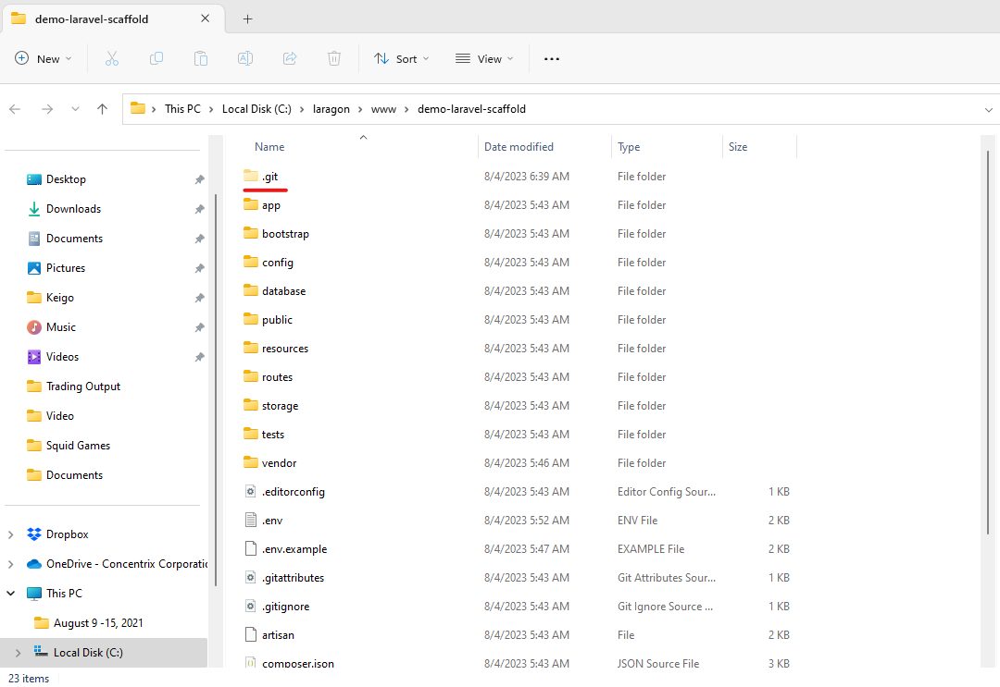

# Creating a new Laravel Project

Open terminal and type:

``` bash
cd C:\laragon\www\
```

Make sure that we are on the <code>C:\\laragon\\www\\</code> folder before creating any laravel project. Once done, we can now clone our project scaffolding:
	
``` bash
git clone https://github.com/keigo56/cnx-laravel-project-scaffold.git project-name
```

Note that we are using project scaffold instead of creating a default Laravel project. This is to save time and promote consistency in project development by establishing a common structure that aligns with best practices for the particular type of project.

<div style="background-color: #030712; padding: 1rem; margin-bottom: 1rem; border-radius: 0.5rem; font-size: 0.9rem;">
<h5 style="margin: 0 0 0.5rem; font-size: 1rem">Tip</h5>
A project scaffold, often referred to as a project template or boilerplate, is a pre-configured and organized directory structure that serves as a starting point for a specific type of software project. It provides a basic foundation and structure, including essential files and directories, to help developers quickly set up new projects without having to start from scratch.
</div>
Once done, you can now go inside the project folder:

``` bash
cd project-name
```

Open folder in File Explorer and delete the <code>.git</code> folder:

``` bash
explorer .
```



Run <code>composer install</code> to install Laravel related dependencies and packages:
``` bash
composer install
```
Copy <code>.env.example</code> file to <code>.env</code>. The <code>.env</code> file contains all the project related values such as database username and password.
``` bash
cp .env.example .env
```

Open <code>.env</code> file and update the values on the keys below:
``` dotenv
OAUTH_APP_ID=
OAUTH_APP_SECRET=
```

Generate a project key. The project key is what Laravel uses to encrypt data within the application:
``` bash
php artisan key:generate
```

Open Workbench and create schema. Update the database related credentials on the <code>.env</code> file. 
``` dotenv
DB_CONNECTION=mysql
DB_HOST=127.0.0.1
DB_PORT=3306
DB_DATABASE=cnx_laravel_project_scaffold
DB_USERNAME=root
DB_PASSWORD=
```

Run the command below to run migrations and seeders:
``` bash
php artisan migrate:fresh --seed
```  

Open the project in VsCode:
``` bash
code .
```
Run the project:
``` bash
php artisan serve
```   