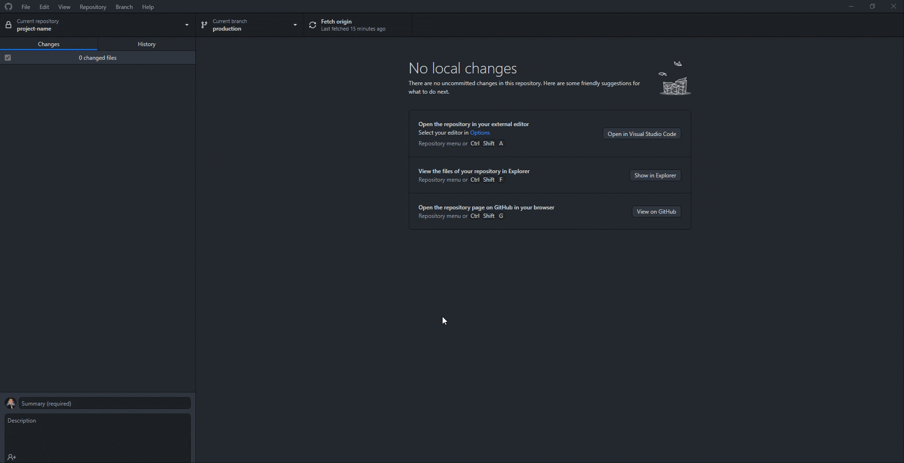

# Setting up GitHub Repository

## Create local repository

1. Make sure that you are inside the project directory before running any git command. 

   ``` bash
   cd C:/laragon/www/laravel-project
   ```

2. To initialize a git repository, run:

   ``` bash
   git init
   ```

3. Once the repository has been initialized, open GitHub Desktop to add a local repository.
Click <code>File >> Add a local repository</code> and select the project folder.

   

4. We can now add our initial commit:

   

5. Once we have our first commit, we can now add three different branches (local, development, production)
   - <code>local</code> source code copy for local development
   - <code>development</code> source code copy dedicated for development server
   - <code>production</code> production ready code to be pulled on the production server

      

6. We can now publish our repository to GitHub:

   

7. We can now add collaborators to our project:
   1. Open Github Desktop
   2. Click <code>View on GitHub</code> 
   3. Go to repository settings
   4. Click <code>Collaborators</code>
   5. Click <code>Add people</code>
   6. Search for the username of the collaborator
   7. Click <code>Add collaborator to this repository</code>
   
   

8. Create GitHub Token. GitHub Tokens are used to authenticate git when pulling changes from GitHub to <code>development</code> or <code>production</code> server. To generate a new token, kindly follow the steps below:
   1. Open GitHub Repository
   2. Go to Main Settings
   3. Go to Developer Options
   4. Click Personal Access tokens
   5. Click Tokens Classic
   6. Click Generate New Token and select Classic Token
   7. Add name of the token: <code>project_name_token</code>
   8. On the dropdown of expiration, select <code>No Expiration</code>
   9. Select <code>repo</code> checkbox
   10. Click <code>Generate Token</code>
   11. Make sure to copy the generated token and save it as this will only be displayed once
   
   <iframe style="margin-top: 15px;" src="https://www.veed.io/embed/b1a72dfc-94e0-4a4b-9f58-bd1978b9d52b" width="100%" height="504" frameborder="0" title="Screen Recording - 13 February 2023" webkitallowfullscreen mozallowfullscreen allowfullscreen></iframe>
   

## Clone a GitHub repository
   ### Accept Invitation
   1. Open [GitHub Main Page](https://github.com)
   2. In the top right corner, click your avatar and select <code>Your organizations</code>
   3. Find the invitation related to the project and click <code>Join</code>
   4. Review the invitation and click <code>Accept Invitation</code>
   
   ### Clone repository
   1. Open GitHub Desktop
   2. In the top left corner click <code>File</code> and select <code>Clone repository</code>
   3. Search for the repository name. If nothing shows, click the reload icon next to the search bar.
   4. Make sure that the Local path is correct and is located in <code>C:/laragon/www/</code>
   5. Click the <code>Clone</code> button
   
   <iframe style="margin-top: 15px;" src="https://www.veed.io/embed/856b4e6c-c4d7-4ef7-b901-ccfc81dd85ff" width="100%" height="504" frameborder="0" title="How to Clone a GitHub Repository" webkitallowfullscreen mozallowfullscreen allowfullscreen></iframe>
   
   ### Setup repository
   1. Open terminal and go inside the project folder:
      ``` bash
      cd C:/laragon/www/cloned-laravel-project
      ```
   2. Run <code>composer install</code> to install Laravel related dependencies and packages:
      ``` bash
      composer install
      ```
   3. Copy <code>.env.example</code> file to <code>.env</code>. The <code>.env</code> file contains all the project related values such as database username and password.
      ``` bash
      cp .env.example .env
      ```
      
   4. Open <code>.env</code> file and update the values on the keys below:
      ``` dotenv
      OAUTH_APP_ID=
      OAUTH_APP_SECRET=
      ```
      
   5. Generate a project key. The project key is what Laravel uses to encrypt data within the application:
      ``` bash
      php artisan key:generate
      ```
      
   6. Open Workbench and create schema. Update the database related credentials on the <code>.env</code> file.
      ``` dotenv
      DB_CONNECTION=mysql
      DB_HOST=127.0.0.1
      DB_PORT=3306
      DB_DATABASE=cnx_laravel_project_scaffold
      DB_USERNAME=root
      DB_PASSWORD=
      ```
      
   7. Run the command below to run migrations and seeders:
      ``` bash
      php artisan migrate:fresh --seed
      ```  
      
   8. Open the project in VsCode:
      ``` bash
      code .
      ```
   9. Run the project:
      ``` bash
      php artisan serve
      ```   
   