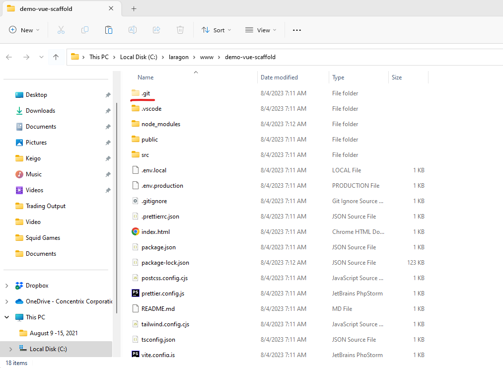

# Creating a new Vue Project

Open terminal and type:

``` bash
cd C:\laragon\www\
```

Make sure that we are on the <code>C:\\laragon\\www\\</code> folder before creating any vue project. Once done, we can now clone our project scaffolding:

``` bash
git clone https://github.com/keigo56/cnx-vue-project-template.git vue-project
```

Note that we are using project scaffold instead of creating a default Laravel project. This is to save time and promote consistency in project development by establishing a common structure that aligns with best practices for the particular type of project.

<div style="background-color: #030712; padding: 1rem; margin-bottom: 1rem; border-radius: 0.5rem; font-size: 0.9rem;">
<h5 style="margin: 0 0 0.5rem; font-size: 1rem">Tip</h5>
A project scaffold, often referred to as a project template or boilerplate, is a pre-configured and organized directory structure that serves as a starting point for a specific type of software project. It provides a basic foundation and structure, including essential files and directories, to help developers quickly set up new projects without having to start from scratch.
</div>

Once done, you can now go inside the project folder:

``` bash
cd vue-project
```

Open folder in File Explorer and delete the <code>.git</code> folder:

``` bash
explorer .
```



Run <code>npm install</code> to install Vue application related dependencies and packages:
``` bash
npm install
```

Run the project:
``` bash
npm run dev
```