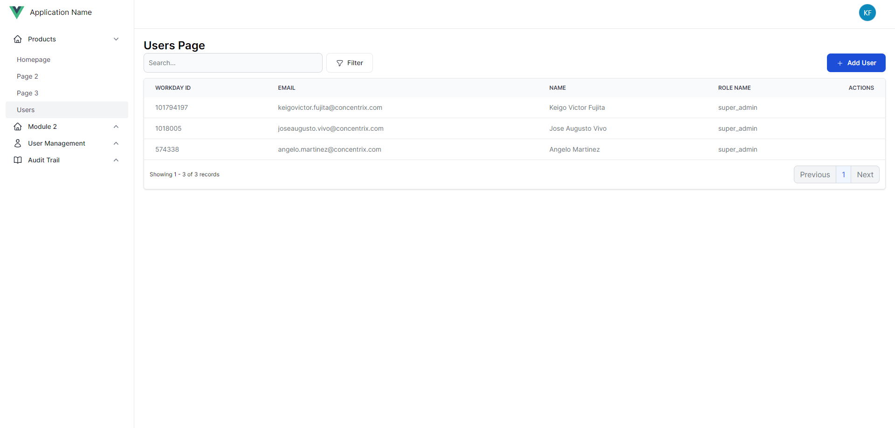

# Setup Datatables

## Creating Datatable Instance
1. Open the page component where you wanted to add the datatable component. In this example we are using the <code>UserIndexPage</code> and we'll add a new datatable.
   ``` vue{5-8}
   <template>
     <BaseLayout>
       <div class="p-5">
         <h1 class="font-semibold text-2xl dark:text-white">Users Page</h1>
         <DataTable
             source-url="/api/datatable/users"
         >
         </DataTable>
       </div>
     </BaseLayout>
   </template>
   
   <script setup>
   import BaseLayout from "@/layouts/BaseLayout.vue";
   import DataTable from "@/modules/datatable/DataTable.vue";
   </script>
   ```
   The highlighted code above creates a new Datatable component accepting <code>source-url</code> as a parameter. Those parameters are also known as component props.

## Customizing Datatable
We can now customize our datatable instance using component props. These props controls the behavior and layout of our datatable component. Below are the list of available props:

- <code>source-url: String</code> : specifies the API endpoint on where to get the datatable data
- <code>can-export: Boolean</code> : specifies if the datatable needs export function. Default value is set to <code>false</code>.
- <code>export-url: String</code> : specifies the export API endpoint of the datatable data
- <code>export-file-name: String</code> : specifies the name of the export file
- <code>withActionItems: Boolean</code> : specifies if the datatable needs to show Action Item column. Default value is set to <code>true</code>.

## Customizing Datatable Action Items
Depending on the datatable, sometimes we may need to add custom action items. Let's say for example we need to add a <code>Create</code> button on our datatable, we can do so by adding this inside the Datatable slot:
``` vue{8-16}
<template>
  <BaseLayout>
    <div class="p-5">
      <h1 class="font-semibold text-2xl dark:text-white">Users Page</h1>
      <DataTable
          source-url="/api/datatable/users"
      >
       <template #actionItems>
         <button
           type="button"
           class="text-white bg-blue-700 hover:bg-blue-800 focus:ring-4 focus:ring-blue-300 font-medium rounded-lg text-sm px-5 py-2.5 dark:bg-blue-600 dark:hover:bg-blue-700 focus:outline-none dark:focus:ring-blue-800"
         >
           <PlusIcon class="w-4 h-4 mr-2 inline" />
           <span>Add User</span>
         </button>
        </template>
      </DataTable>
    </div>
  </BaseLayout>
</template>

<script setup>
import { PlusIcon } from "@heroicons/vue/24/outline/index.js";
import BaseLayout from "@/layouts/BaseLayout.vue";
import DataTable from "@/modules/datatable/DataTable.vue";
</script>
```
The result of the above code would be:



You'll notice that the create button is inserted on the right side of the datatable.

## Customizing Row Action Items
Let's say we wanted to add <code>Edit</code> button on every row of our datatable, we can do so by adding this inside the Datatable slot:
``` vue{18-25}
<template>
  <BaseLayout>
    <div class="p-5">
      <h1 class="font-semibold text-2xl dark:text-white">Users Page</h1>
      <DataTable
          source-url="/api/datatable/users"
      >
       <template #actionItems>
         <button
           type="button"
           class="text-white bg-blue-700 hover:bg-blue-800 focus:ring-4 focus:ring-blue-300 font-medium rounded-lg text-sm px-5 py-2.5 dark:bg-blue-600 dark:hover:bg-blue-700 focus:outline-none dark:focus:ring-blue-800"
         >
           <PlusIcon class="w-4 h-4 mr-2 inline" />
           <span>Add User</span>
         </button>
        </template>
        
        <template v-slot:rowActionItems="props">
          <a
              href="#"
              class="font-medium text-blue-600 dark:text-blue-500 hover:underline"
          >
            Edit
          </a>
        </template>
        
      </DataTable>
    </div>
  </BaseLayout>
</template>

<script setup>
import { PlusIcon } from "@heroicons/vue/24/outline/index.js";
import BaseLayout from "@/layouts/BaseLayout.vue";
import DataTable from "@/modules/datatable/DataTable.vue";
</script>
```
The result of the above code would be:


You'll notice that the edit button is now inserted on every row in our datatable.