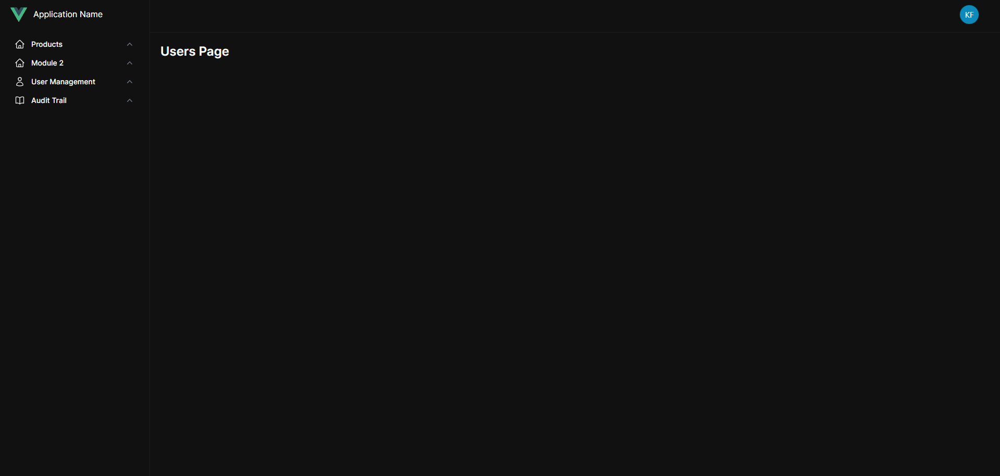
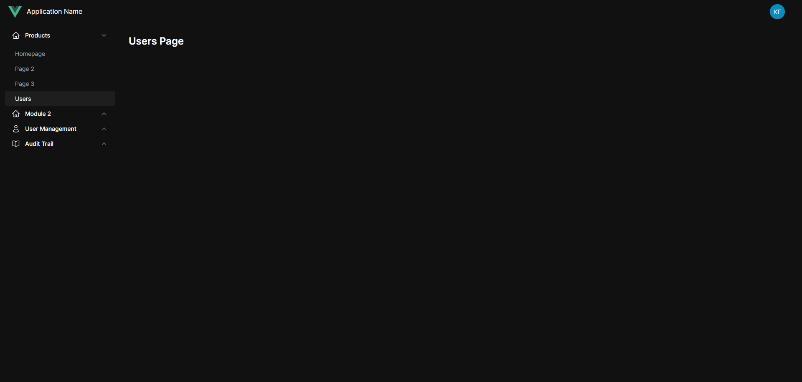

# Setup Forms

1. Create a page component in <code>src/pages</code> directory. Make sure that the component name ends in <code>Page</code> to easily identify page components. Examples are <code>DriverIndexPage</code>, <code>UserIndexPage</code>, <code>UserEditPage</code>.
   ``` vue
   <template>
    <!-- This is where we code the HTML of the component -->
   </template>
    
   <script setup>
    /* This is where we define Javascript to make our component dynamic */
   </script>
   ```
2. After the page component has been created, we can now register our page component in our routes. Open <code>routes/routes.js</code> file and add the following code:
   ```js
   {
       path: "/users",
       component: UsersIndexPage,
       meta: {
      		middleware: ["auth", "can:view_users"],
       },
   },
   ```
   - <code>path: "/users"</code> is the URL Path to access the page component
   - <code>component: UsersIndexPage</code> indicates what component to instantiate when the user access the URL path defined above
   - <code>middleware: ["auth", "can:view_users"]</code> tells what middleware is needed on accessing the page. The <code>auth</code> means that only authenticated users can access the route and <code>can:view_users</code> is a permission middleware checking if the user has <code>view_users</code> permissions.
 
3. We can now customize the design of our page. We can use pre-defined layouts or we can create our own layout. 
    ```vue
    <template>
      <BaseLayout>
        <div class="p-5">
          <h1 class="font-semibold text-2xl dark:text-white">Users Page</h1>
        </div>
      </BaseLayout>
    </template>
    
    <script setup>
    import BaseLayout from "@/layouts/BaseLayout.vue";
    </script>
    ```
    This is what it will look like once we visit the <code>/users</code> page in the browser.
  
   
4. Depending on the page, we may need to add a sidebar item in our sidebar navigation to access the page we created. To add a sidebar item open <code>components/navigation/Sidebar.vue</code> component and add the following lines:
   ```js
   {
     label: "Users",
     href: "/users",
     active: isCurrentPath("/users"),
     visible: hasPermission("view_users"),
   },   
   ```
   This is what it will look like once we visit the <code>/users</code> page in the browser.

   
   You'll notice that there is a new sidebar item created under the Products module. You may customize the entire sidebar layout depending on the project. 